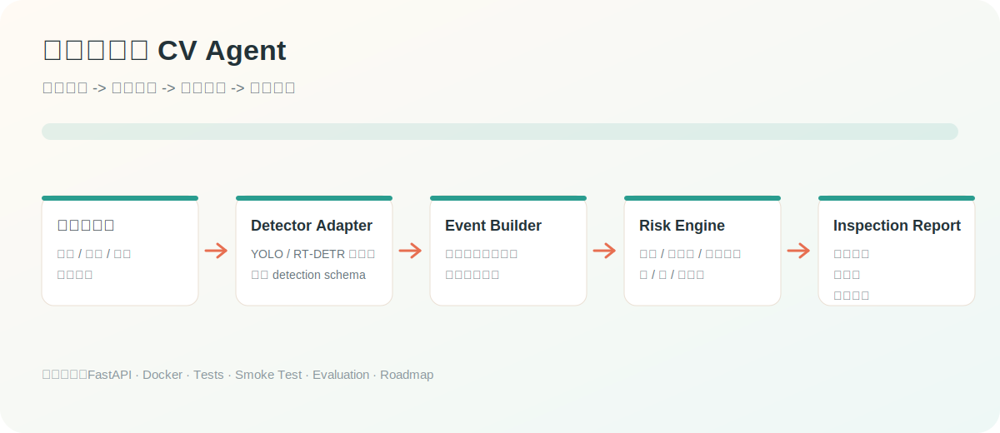
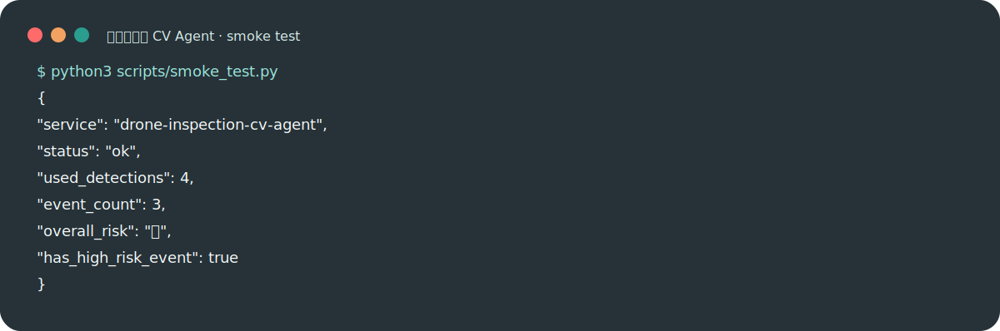

# 无人机巡检 CV Agent

[](https://github.com/ranrango/drone-inspection-cv-agent/actions/workflows/ci.yml)
[](https://www.python.org/)
[](https://fastapi.tiangolo.com/)
[](LICENSE)

把无人机目标检测项目包装成可交付的 Agent 工程。项目参考 `ranrango/drone-object-detection` 的 CV 基线组织方式，但进一步把检测结果封装为 Agent 可调用工具：检测、事件归并、风险评分、巡检报告生成。

当前版本默认使用样例检测结果演示，不提交模型权重和真实视频。真实部署时可以把 `detector.py` 中的模拟检测器替换成 YOLOv8、RT-DETR、GroundingDINO 或你的 `drone-object-detection` 权重推理入口。

## 视觉概览





## 项目亮点

| 能力 | 设计 |
|---|---|
| CV 工具化 | 将检测模型封装成 `detect_objects` 工具，输出统一 schema |
| 巡检 Agent | 对检测结果做过滤、聚合、风险评分和处置建议 |
| 可交付 API | 提供 `/inspect`、`/report`、`/health` 接口 |
| 可讲工程化 | 说明模型权重、数据、输出、日志、部署和验收边界 |
| 面试友好 | 能自然连接你的无人机检测项目，并解释如何包装成 Agent 工具 |

## 快速开始

不安装依赖即可运行 CLI：

```bash
cd 02_drone_inspection_cv_agent
python3 -m src.app.cli --source sample_data/sample_detections.json
```

启动 API：

```bash
python3 -m venv .venv
source .venv/bin/activate
pip install -e ".[dev]"
uvicorn src.app.main:app --reload --port 8020
```

## 一键自检

```bash
python3 scripts/smoke_test.py
```

预期输出会包含：

```json
{
  "service": "drone-inspection-cv-agent",
  "status": "ok",
  "event_count": 3,
  "overall_risk": "高",
  "has_high_risk_event": true
}
```

更多请求样例见 [`examples/inspect_request.json`](examples/inspect_request.json)，巡检报告检查点见 [`examples/expected_report.md`](examples/expected_report.md)。

## 与无人机检测项目的关系

`drone-object-detection` 更像 CV 模型基线：数据转换、训练、验证、推理。本项目更像业务交付层：把模型输出接入巡检流程，生成面向业务方的事件、风险等级和报告。

```text
无人机视频/图片
  -> CV 检测模型
  -> 标准化 detection schema
  -> 巡检 Agent 工具链
  -> 异常事件 / 风险评分 / 报告 / API
```

## 项目结构

```text
02_drone_inspection_cv_agent/
├── src/app/
│   ├── detector.py       # 检测工具适配层
│   ├── agent.py          # 巡检 Agent 编排
│   ├── main.py           # FastAPI 入口
│   └── cli.py            # 命令行入口
├── sample_data/          # 样例检测输出和航线配置
├── examples/             # 请求样例和预期报告
├── scripts/              # smoke test 等工程脚本
├── docs/                 # 架构、API、部署、评估、路线图、面试稿
├── tests/
├── Dockerfile
├── docker-compose.yml
├── Makefile
└── pyproject.toml
```

## 已知局限

- 当前样例检测器不做真实图像推理，只演示 Agent 工程链路。
- 真实上线需要接入视频抽帧、模型推理、GPU 调度和结果落库。
- 风险规则是可解释基线，生产应结合业务规则和人工标注持续校准。

## 评估与路线图

- [`docs/evaluation.md`](docs/evaluation.md)：覆盖检测准确率、事件准确率、误报率、告警召回和报告可用性。
- [`docs/roadmap.md`](docs/roadmap.md)：说明如何从样例检测结果升级到真实 YOLO 推理、轨迹聚合、工单告警和 GPU 部署。
